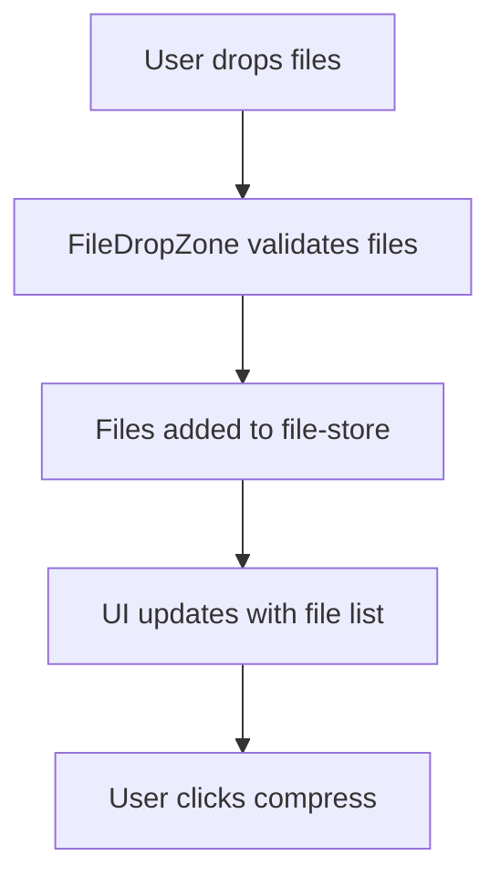
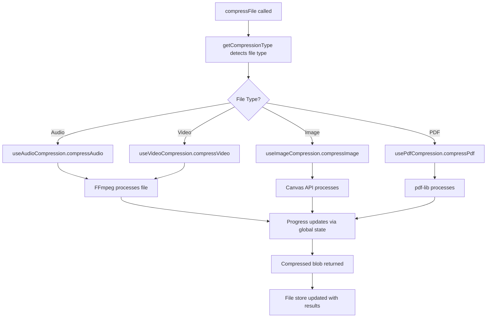
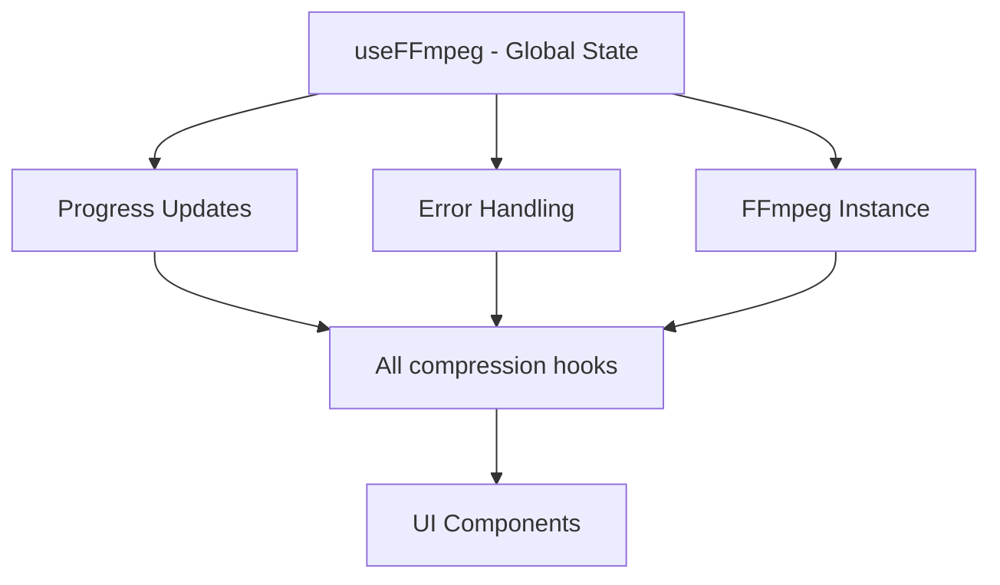

# 🗜️ Quick Compression - Developer Guide

A modular, scalable file compression application built with Next.js, TypeScript, and FFmpeg. Supports audio, video, image, and PDF compression with real-time progress tracking.

## 📋 Table of Contents

- [Architecture Overview](#architecture-overview)
- [Project Structure](#project-structure)
- [Compression Flow](#compression-flow)
- [Adding New File Types](#adding-new-file-types)
- [Debugging Guide](#debugging-guide)
- [Development Workflow](#development-workflow)
- [Performance Considerations](#performance-considerations)
- [Troubleshooting](#troubleshooting)

## 🏗️ Architecture Overview

### Core Design Principles

1. **Modular Architecture**: Each compression type has its own specialized hook
2. **Shared State Management**: Single FFmpeg instance with global state using Zustand
3. **Type Safety**: Comprehensive TypeScript coverage with centralized types
4. **Separation of Concerns**: Clear separation between UI, business logic, and utilities
5. **Scalability**: Easy to add new compression types without touching existing code

### Hook Hierarchy

```
useCompression (Main Orchestrator - 96 lines)
├── useFFmpeg (Shared FFmpeg Instance - 140 lines)
├── useAudioCompression (67 lines)
├── useVideoCompression (69 lines)
├── useImageCompression (72 lines)
└── usePdfCompression (78 lines)
```

### State Management

```
Zustand Stores:
├── file-store.ts - File management and results
├── settings-store.ts - Compression settings
└── compression-store.ts - Compression state
```

## 📁 Project Structure

```
src/
├── app/
│   ├── page.tsx                 # Main application page (404 lines)
│   ├── layout.tsx              # Root layout with providers
│   └── globals.css             # Global styles
├── components/
│   ├── ui/                     # Shadcn/ui components
│   ├── FileDropZone.tsx        # File upload interface
│   ├── CompressionSettings.tsx # Settings panel
│   ├── ProgressDisplay.tsx     # Progress and stats
│   └── FileListResults.tsx     # Results display
├── lib/                        # Core compression hooks
│   ├── useFFmpeg.ts           # Shared FFmpeg instance
│   ├── useCompression.tsx     # Main orchestrator
│   ├── useAudioCompression.ts # Audio-specific logic
│   ├── useVideoCompression.ts # Video-specific logic
│   ├── useImageCompression.ts # Image-specific logic
│   └── usePdfCompression.ts   # PDF-specific logic
├── store/                     # Zustand state stores
│   ├── file-store.ts         # File management
│   ├── settings-store.ts     # Settings state
│   └── compression-store.ts  # Compression state
├── types/
│   └── index.ts              # Centralized TypeScript types
└── utils/                    # Utility functions
    ├── compression-helpers.ts    # Core compression utilities
    ├── compression-defaults.ts  # Smart default settings
    ├── ffmpeg-args-builder.ts  # FFmpeg argument construction
    ├── file-compression.ts     # File type detection
    ├── file-size-formatter.ts # Size formatting
    ├── file-name-generator.ts # Name generation
    └── download-helper.ts     # Download utilities
```

## 🔄 Compression Flow

### 1. File Upload Flow


### 2. Compression Process Flow


### 3. State Management Flow


## ➕ Adding New File Types

### Step 1: Update Types
```typescript
// types/index.ts
export interface CompressionOptions {
  // Add your new compression options
  newFileTypeQuality?: number;
  newFileTypeFormat?: string;
  // ... other options
}
```

### Step 2: Create Specialized Hook
```typescript
// lib/useNewFileTypeCompression.ts
"use client"

import { useCallback } from 'react';
import { CompressionOptions } from '@/types';
import { useFFmpeg } from './useFFmpeg';

export const useNewFileTypeCompression = (defaultOptions: CompressionOptions = {}) => {
  const { setCompressionProgress, clearError } = useFFmpeg();

  const compressNewFileType = useCallback(async (
    file: File,
    customOptions: CompressionOptions = {}
  ): Promise<Blob> => {
    clearError();
    setCompressionProgress(0);

    try {
      // Your compression logic here
      setCompressionProgress(50);
      
      // Process the file
      const result = await processFile(file, options);
      
      setCompressionProgress(100);
      return result;
    } catch (err) {
      throw new Error(`Compression failed: ${err instanceof Error ? err.message : 'Unknown error'}`);
    } finally {
      setTimeout(() => setCompressionProgress(null), 1000);
    }
  }, [setCompressionProgress, clearError]);

  return { compressNewFileType };
};
```

### Step 3: Add to Main Orchestrator
```typescript
// lib/useCompression.tsx
import { useNewFileTypeCompression } from './useNewFileTypeCompression';

export const useCompression = (defaultOptions: CompressionOptions = {}) => {
  // Add the new hook
  const { compressNewFileType } = useNewFileTypeCompression(defaultOptions);
  
  // Add wrapper function
  const handleNewFileTypeCompression = async (file: File, customOptions: CompressionOptions = {}): Promise<Blob> => {
    setIsCompressing(true);
    try {
      return await compressNewFileType(file, customOptions);
    } finally {
      setIsCompressing(false);
    }
  };

  return {
    // Add to exports
    compressNewFileType: handleNewFileTypeCompression,
    // ... other exports
  };
};
```

### Step 4: Update File Type Detection
```typescript
// utils/file-compression.ts
export function getCompressionType(file: File): 'audio' | 'video' | 'image' | 'pdf' | 'newFileType' | null {
  // Add your file type detection logic
  if (file.type === 'application/your-type' || file.name.toLowerCase().endsWith('.ext')) {
    return 'newFileType';
  }
  // ... existing logic
}
```

### Step 5: Update Main App Logic
```typescript
// app/page.tsx
const { compressNewFileType } = useCompression(compressionOptions);

// In the compression logic:
if (compressionType === 'newFileType') {
  compressedBlob = await compressNewFileType(file, compressionOptions);
}
```

### Step 6: Add Defaults (Optional)
```typescript
// utils/compression-defaults.ts
export function getSmartDefaults(file: File, type: string): CompressionOptions {
  switch (type) {
    case 'newFileType':
      return {
        newFileTypeQuality: fileSizeMB > 10 ? 0.7 : 0.9,
        newFileTypeFormat: 'optimized'
      };
    // ... existing cases
  }
}
```

## 🐛 Debugging Guide

### Debug FFmpeg Issues
```typescript
// Enable FFmpeg logging
ffmpegInstance.on('log', ({ message }) => {
  console.log('FFmpeg Log:', message);
});
```

### Debug Progress Issues
```typescript
// Check global state updates
console.log('Global progress:', globalCompressionProgress);
console.log('Listeners count:', listeners.size);
```

### Debug File Type Detection
```typescript
// In getCompressionType function
console.log('File type:', file.type);
console.log('File name:', file.name);
console.log('Detected type:', detectedType);
```

### Debug Compression Arguments
```typescript
// In compression hooks
console.log('Compression options:', options);
console.log('FFmpeg args:', args);
```

### Common Debug Points
1. **FFmpeg not loading**: Check browser console for WASM errors
2. **Progress not updating**: Verify useFFmpeg singleton pattern
3. **File type not detected**: Check MIME types and file extensions
4. **Compression failing**: Enable FFmpeg logging to see detailed errors

## 🚀 Development Workflow

### Running the Application
```bash
# Development mode
pnpm dev

# Build for production
pnpm build
pnpm start

# Type checking
pnpm type-check

# Linting
pnpm lint
```

### Adding Dependencies
```bash
# Add new compression library
pnpm add new-compression-lib

# Add development dependency
pnpm add -D @types/new-lib
```

### Testing Compression
1. **Small files first**: Test with small files to debug logic
2. **Different formats**: Test various file formats for your type
3. **Edge cases**: Test corrupted files, very large files, unsupported formats
4. **Progress tracking**: Ensure progress updates correctly
5. **Error handling**: Test error scenarios

## ⚡ Performance Considerations

### Memory Management
- FFmpeg operations can use significant memory
- Clean up virtual files after compression
- Consider implementing file size limits

### Browser Limitations
- Large files may cause browser to freeze
- Consider Web Workers for heavy processing
- Implement chunked processing for very large files

### Optimization Tips
```typescript
// Optimize FFmpeg arguments for speed
const args = ['-preset', 'ultrafast', '-crf', '28'];

// Clean up immediately after use
await ffmpegInstance.deleteFile(inputFileName);
await ffmpegInstance.deleteFile(outputFileName);

// Use appropriate quality settings
const quality = fileSizeMB > 100 ? 'screen' : 'ebook'; // PDF example
```

## 🔧 Troubleshooting

### FFmpeg Not Loading
```bash
# Check if FFmpeg resources are accessible
curl https://unpkg.com/@ffmpeg/core@0.12.6/dist/umd/ffmpeg-core.wasm
```

### TypeScript Errors
```bash
# Regenerate types
pnpm type-check

# Clear Next.js cache
rm -rf .next
pnpm dev
```

### Progress Not Updating
1. Check if multiple useFFmpeg instances are created
2. Verify singleton pattern is working
3. Check listener registration

### Compilation Errors
1. Check import paths are correct
2. Verify all types are properly exported
3. Ensure dependencies are installed

## 📚 Key Files to Understand

1. **`lib/useFFmpeg.ts`**: Singleton pattern, global state management
2. **`lib/useCompression.tsx`**: Main orchestrator, how hooks are combined
3. **`utils/ffmpeg-args-builder.ts`**: How FFmpeg arguments are constructed
4. **`utils/compression-defaults.ts`**: Smart defaults based on file size
5. **`store/file-store.ts`**: File state management with Zustand

## 🎯 Best Practices

1. **Keep hooks under 100 lines** when possible
2. **Always handle errors gracefully** with user-friendly messages
3. **Update progress regularly** for good UX
4. **Clean up resources** after compression
5. **Use TypeScript strictly** - avoid `any` types
6. **Test with real files** of various sizes and formats
7. **Document new compression parameters** in types
8. **Follow the established patterns** when adding new features

---

Happy coding! 🚀 The modular architecture makes it easy to add new compression types while maintaining clean, maintainable code.