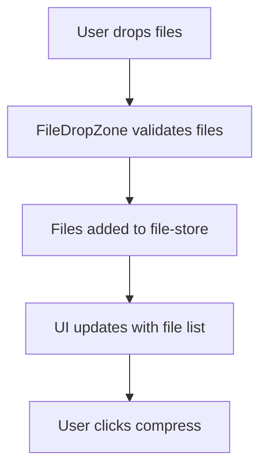
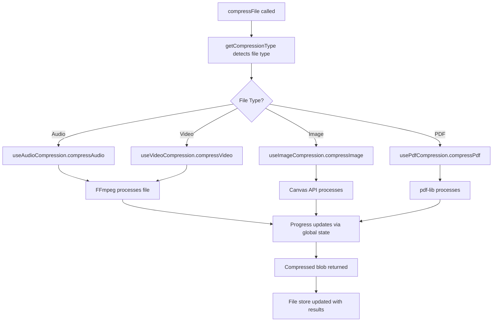
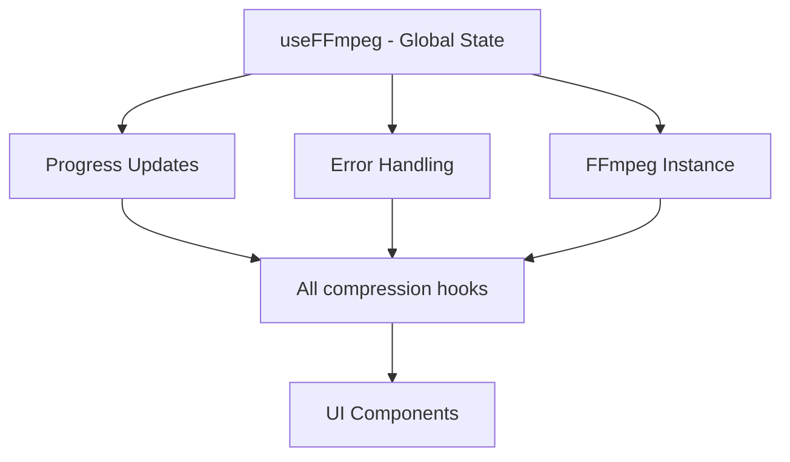
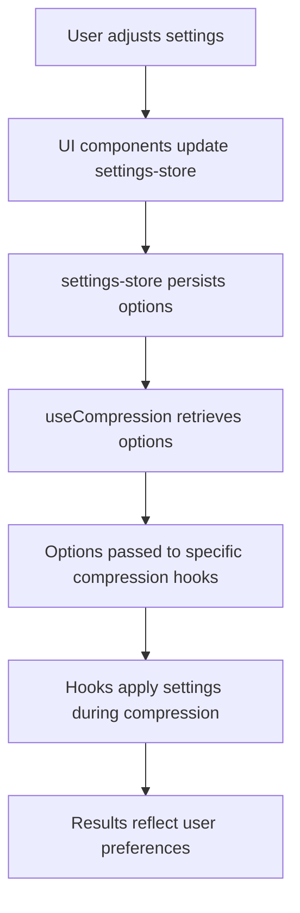

# 🗜️ Quick Compression - Developer Guide

Quick Compression is an open-source, modular file compression tool built with Next.js, TypeScript, FFmpeg, and pdf-lib. It supports audio, video, image, and PDF compression, all processed locally in your browser for privacy—no files are uploaded to a server. The app features real-time progress tracking, detailed error handling, and a modern UI for selecting compression options.

## 🆕 Recent Updates

- **Audio Format Selector Fix**: The audio format selector now correctly maps codecs to output formats and MIME types (e.g., Opus uses OGG).
- **Improved FFmpeg Argument Handling**: Audio and video compression now use robust argument construction for better compatibility and output reliability.
- **Detailed Logging & Error Handling**: All compression hooks provide detailed logs and user-friendly error messages for easier debugging.
- **UI Updates for Image/Video Settings**: Resolution selection for images and videos now uses presets (e.g., 720p, 1080p) with support for custom values, improving usability and state synchronization.

## 🚀 **New: Real PDF Compression with pdf-lib**

The application now includes **real PDF compression** using the pdf-lib library:
- ✅ **Metadata removal** for privacy and size reduction
- ✅ **Form flattening** to convert interactive forms to static content  
- ✅ **Quality-based compression** (screen, ebook, printer, prepress)
- ✅ **Object stream optimization** for better compression ratios
- ✅ **Detailed logging** and error handling for PDF-specific issues
- ✅ **Progress tracking** with real-time updates
- ✅ **FileDropZone support** - PDFs can now be uploaded and compressed

## 📋 Table of Contents

- [Architecture Overview](#architecture-overview)
- [Project Structure](#project-structure)
- [Compression Flow](#compression-flow)
- [Adding New File Types](#adding-new-file-types)
- [Debugging Guide](#debugging-guide)
- [Development Workflow](#development-workflow)
- [Performance Considerations](#performance-considerations)
- [Troubleshooting](#troubleshooting)

## 🏗️ Architecture Overview

### Core Design Principles

1. **Modular Architecture**: Each compression type has its own specialized hook
2. **Shared State Management**: Single FFmpeg instance with global state using Zustand
3. **Type Safety**: Comprehensive TypeScript coverage with centralized types
4. **Separation of Concerns**: Clear separation between UI, business logic, and utilities
5. **Scalability**: Easy to add new compression types without touching existing code
6. **Local-Only Processing**: All compression is performed in-browser for privacy—no uploads.

### Hook Hierarchy

The compression system follows a modular architecture where each file type has its own specialized hook, promoting code reusability and maintainability:

```
useCompression (Main Orchestrator - 96 lines)
├── useFFmpeg (Shared FFmpeg Instance - 140 lines)
│   ├── Manages FFmpeg.wasm loading and instance lifecycle
│   ├── Provides global progress tracking and error handling
│   └── Handles virtual file system operations
├── useAudioCompression (67 lines) - FFmpeg-based
│   ├── Handles audio-specific compression with codec-to-format mapping
│   ├── Includes detailed logging and argument validation
│   └── Supports multiple audio formats (MP3, OGG, etc.)
├── useVideoCompression (69 lines) - FFmpeg-based
│   ├── Manages video compression with advanced argument handling
│   ├── Provides resolution and bitrate optimization
│   └── Includes comprehensive error handling and logging
├── useImageCompression (72 lines) - Canvas API-based
│   ├── Performs client-side image resizing and format conversion
│   ├── Uses HTML5 Canvas for efficient processing
│   └── Handles various image formats (JPEG, PNG, WebP)
└── usePdfCompression (78 lines) - pdf-lib-based ⭐ NEW
    ├── Implements real PDF compression with metadata removal
    ├── Supports quality-based compression levels
    └── Provides form flattening and object stream optimization
```

Each compression hook is self-contained, receives options from Zustand stores, and integrates seamlessly with the shared FFmpeg instance for consistent state management.

### State Management

The application uses Zustand for global state management with three specialized stores, each handling separated concerns for better modularity and maintainability:

```
Zustand Stores:
├── file-store.ts - File management and results
│   ├── Manages uploaded files, compression results, and file metadata
│   ├── Tracks file processing status and download URLs
│   └── Handles file queue and batch operations
├── settings-store.ts - Compression settings and options
│   ├── Stores user-configurable compression parameters (quality, format, resolution)
│   ├── Provides preset configurations for different use cases
│   ├── Syncs settings across UI components using reactive state
│   └── Validates and persists user preferences
└── compression-store.ts - Compression state and progress
    ├── Tracks real-time compression progress and status
    ├── Manages FFmpeg instance state and error handling
    ├── Coordinates between compression hooks and UI updates
    └── Handles global compression lifecycle events
```

Each store follows the single responsibility principle, ensuring clean separation of concerns and easy testing.

## 📁 Project Structure

```
src/
├── app/
│   ├── page.tsx                 # Main application page (404 lines)
│   ├── layout.tsx              # Root layout with providers
│   └── globals.css             # Global styles
├── components/
│   ├── ui/                     # Shadcn/ui components
│   ├── FileDropZone.tsx        # File upload interface
│   ├── CompressionSettings.tsx # Settings panel
│   ├── ProgressDisplay.tsx     # Progress and stats
│   ├── FileListResults.tsx     # Results display
│   ├── settings/
│   │   ├── ImageSettings.tsx   # Image settings with resolution presets
│   │   └── VideoSettings.tsx   # Video settings with resolution presets
├── lib/                        # Core compression hooks
│   ├── useFFmpeg.ts           # Shared FFmpeg instance
│   ├── useCompression.tsx     # Main orchestrator
│   ├── useAudioCompression.ts # Audio-specific logic (with codec-to-format mapping, detailed logging)
│   ├── useVideoCompression.ts # Video-specific logic (improved argument handling, logging)
│   ├── useImageCompression.ts # Image-specific logic (canvas-based, error handling)
│   └── usePdfCompression.ts   # PDF-specific logic
├── store/                     # Zustand state stores
│   ├── file-store.ts         # File management
│   ├── settings-store.ts     # Settings state
│   └── compression-store.ts  # Compression state
├── types/
│   └── index.ts              # Centralized TypeScript types
└── utils/                    # Utility functions
    ├── compression-helpers.ts    # Core compression utilities
    ├── compression-defaults.ts  # Smart default settings
    ├── ffmpeg-args-builder.ts  # FFmpeg argument construction
    ├── file-compression.ts     # File type detection
    ├── file-size-formatter.ts # Size formatting
    ├── file-name-generator.ts # Name generation
    └── download-helper.ts     # Download utilities
```

## 🔄 Compression Flow

### 1. File Upload Flow


### 2. Compression Process Flow


### 3. State Management Flow


### 4. Settings and Options Flow


Options are centrally managed in Zustand stores, ensuring consistent configuration across all compression operations and UI components.

### Step 1: Update Types
```typescript
// types/index.ts
export interface CompressionOptions {
  // Add your new compression options
  newFileTypeQuality?: number;
  newFileTypeFormat?: string;
  // ... other options
}
```

### Step 2: Create Specialized Hook
```typescript
// lib/useNewFileTypeCompression.ts
"use client"

import { useCallback } from 'react';
import { CompressionOptions } from '@/types';
import { useFFmpeg } from './useFFmpeg';
import { useSettingsStore } from '@/store/settings-store';

export const useNewFileTypeCompression = () => {
  const { setCompressionProgress, clearError } = useFFmpeg();
  const newFileTypeOptions = useSettingsStore(state => state.newFileTypeOptions);

  const compressNewFileType = useCallback(async (
    file: File
  ): Promise<Blob> => {
    clearError();
    setCompressionProgress(0);

    try {
      // Retrieve options from Zustand store
      const options = { ...newFileTypeOptions };
      
      // Your compression logic here
      setCompressionProgress(50);
      
      // Process the file using options from store
      const result = await processFile(file, options);
      
      setCompressionProgress(100);
      return result;
    } catch (err) {
      throw new Error(`Compression failed: ${err instanceof Error ? err.message : 'Unknown error'}`);
    } finally {
      setTimeout(() => setCompressionProgress(null), 1000);
    }
  }, [setCompressionProgress, clearError]);

  return { compressNewFileType };
};
```

### Step 3: Update Main Orchestrator
```typescript
// lib/useCompression.tsx
import { useNewFileTypeCompression } from './useNewFileTypeCompression';

export const useCompression = () => {
  // Add the new hook (options are retrieved internally from Zustand)
  const { compressNewFileType } = useNewFileTypeCompression();
  
  // Add wrapper function
  const handleNewFileTypeCompression = async (file: File): Promise<Blob> => {
    setIsCompressing(true);
    try {
      return await compressNewFileType(file);
    } finally {
      setIsCompressing(false);
    }
  };

  return {
    // Add to exports
    compressNewFileType: handleNewFileTypeCompression,
    // ... other exports
  };
};
```

### Step 4: Update File Type Detection
```typescript
// utils/file-compression.ts
export function getCompressionType(file: File): 'audio' | 'video' | 'image' | 'pdf' | 'newFileType' | null {
  // Add your file type detection logic
  if (file.type === 'application/your-type' || file.name.toLowerCase().endsWith('.ext')) {
    return 'newFileType';
  }
  // ... existing logic
}
```

### Step 5: Update Main App Logic
```typescript
// app/page.tsx
const { compressNewFileType } = useCompression(compressionOptions);

// In the compression logic:
if (compressionType === 'newFileType') {
  compressedBlob = await compressNewFileType(file, compressionOptions);
}
```

### Step 6: Add Defaults (Optional)
```typescript
// utils/compression-defaults.ts
export function getSmartDefaults(file: File, type: string): CompressionOptions {
  switch (type) {
    case 'newFileType':
      return {
        newFileTypeQuality: fileSizeMB > 10 ? 0.7 : 0.9,
        newFileTypeFormat: 'optimized'
      };
    // ... existing cases
  }
}
```

## 🐛 Debugging Guide

### Debug FFmpeg Issues
```typescript
// Enable FFmpeg logging
ffmpegInstance.on('log', ({ message }) => {
  console.log('FFmpeg Log:', message);
});
```

### Debug Progress Issues
```typescript
// Check global state updates
console.log('Global progress:', globalCompressionProgress);
console.log('Listeners count:', listeners.size);
```

### Debug File Type Detection
```typescript
// In getCompressionType function
console.log('File type:', file.type);
console.log('File name:', file.name);
console.log('Detected type:', detectedType);
```

### Debug Compression Arguments
```typescript
// In compression hooks
console.log('Compression options:', options);
console.log('FFmpeg args:', args);
```

### Audio/Video Compression Debugging
- **Codec-to-Format Mapping**: Audio compression now uses a mapping to ensure the correct output format and MIME type for each codec (e.g., Opus → OGG).
- **FFmpeg Argument Validation**: Arguments are validated and logged before running FFmpeg. Check the browser console for detailed logs if output files are empty or invalid.
- **Error Handling**: All hooks throw user-friendly errors and log technical details for easier troubleshooting.

### UI Debugging
- **Resolution Presets**: Image and video settings use select menus for common resolutions (720p, 1080p, etc.), with custom value support. State is synchronized using Zustand.
- **State Synchronization**: Check Zustand store updates for settings changes. Use browser dev tools to inspect store state.

### Debug Zustand State
```typescript
// Debug settings store
import { useSettingsStore } from '@/store/settings-store';
const settings = useSettingsStore.getState();
console.log('Current settings:', settings);

// Debug file store
import { useFileStore } from '@/store/file-store';
const files = useFileStore.getState();
console.log('Current files:', files);

// Debug compression store
import { useCompressionStore } from '@/store/compression-store';
const compressionState = useCompressionStore.getState();
console.log('Compression state:', compressionState);
```

### Common Debug Points
1. **FFmpeg not loading**: Check browser console for WASM errors
2. **Progress not updating**: Verify useFFmpeg singleton pattern
3. **File type not detected**: Check MIME types and file extensions
4. **Compression failing**: Enable FFmpeg logging to see detailed errors

## 🚀 Development Workflow

### Running the Application
```bash
# Development mode
pnpm dev

# Build for production
pnpm build
pnpm start

# Type checking
pnpm type-check

# Linting
pnpm lint
```

### Adding Dependencies
```bash
# Add new compression library
pnpm add new-compression-lib

# Add development dependency
pnpm add -D @types/new-lib
```

### Testing Compression
1. **Small files first**: Test with small files to debug logic
2. **Different formats**: Test various file formats for your type
3. **Edge cases**: Test corrupted files, very large files, unsupported formats
4. **Progress tracking**: Ensure progress updates correctly
5. **Error handling**: Test error scenarios

## ⚡ Performance Considerations

### Memory Management
- FFmpeg operations can use significant memory
- Clean up virtual files after compression
- Consider implementing file size limits

### Browser Limitations
- Large files may cause browser to freeze
- Consider Web Workers for heavy processing
- Implement chunked processing for very large files

### Optimization Tips
```typescript
// Optimize FFmpeg arguments for speed
const args = ['-preset', 'ultrafast', '-crf', '28'];

// Clean up immediately after use
await ffmpegInstance.deleteFile(inputFileName);
await ffmpegInstance.deleteFile(outputFileName);

// Use appropriate quality settings
const quality = fileSizeMB > 100 ? 'screen' : 'ebook'; // PDF example
```

## 🔧 Troubleshooting

### FFmpeg Not Loading
```bash
# Check if FFmpeg resources are accessible
curl https://unpkg.com/@ffmpeg/core@0.12.6/dist/umd/ffmpeg-core.wasm
```

### TypeScript Errors
```bash
# Regenerate types
pnpm type-check

# Clear Next.js cache
rm -rf .next
pnpm dev
```

### Progress Not Updating
1. Check if multiple useFFmpeg instances are created
2. Verify singleton pattern is working
3. Check listener registration

### Compilation Errors
1. Check import paths are correct
2. Verify all types are properly exported
3. Ensure dependencies are installed

## 📚 Key Files to Understand

1. **`lib/useFFmpeg.ts`**: Singleton pattern, global state management
2. **`lib/useCompression.tsx`**: Main orchestrator, how hooks are combined
3. **`utils/ffmpeg-args-builder.ts`**: How FFmpeg arguments are constructed
4. **`utils/compression-defaults.ts`**: Smart defaults based on file size
5. **`store/file-store.ts`**: File state management with Zustand

## 🎯 Best Practices

1. **Use Preset Selectors for Resolution**: Prefer using the built-in resolution presets for images and videos to ensure optimal results and avoid invalid input.
2. **Check Codec/Format Mapping**: When compressing audio, verify the codec-to-format mapping to ensure correct output.
3. **Enable Logging for Debugging**: Use browser console logs to trace FFmpeg arguments and error messages.
4. **Test UI State Sync**: When updating settings, verify that the UI reflects the current state, especially for custom resolution values.
5. **Leverage Zustand for State Management**: Use the separated store logics (settings, files, compression) for clean state management and avoid prop drilling.
6. **Keep hooks under 100 lines** when possible
7. **Always handle errors gracefully** with user-friendly messages
8. **Update progress regularly** for good UX
9. **Clean up resources** after compression
10. **Use TypeScript strictly** - avoid `any` types
11. **Test with real files** of various sizes and formats
12. **Document new compression parameters** in types
13. **Follow the established patterns** when adding new features

---

Happy coding! 🚀 The modular architecture makes it easy to add new compression types while maintaining clean, maintainable code.